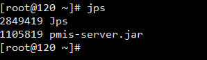
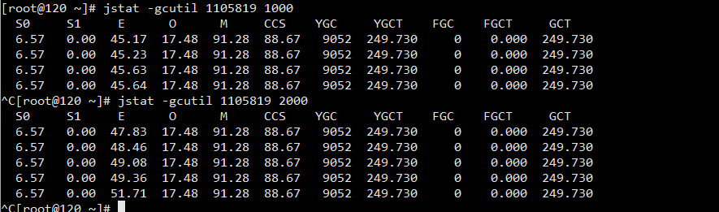
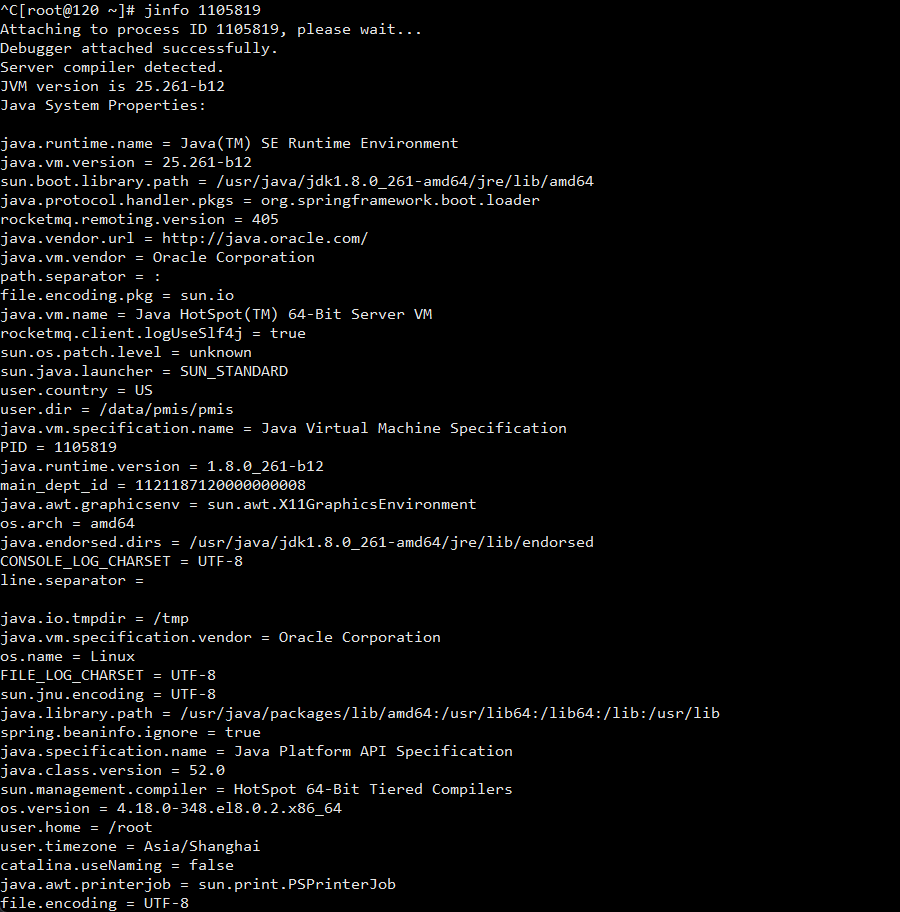
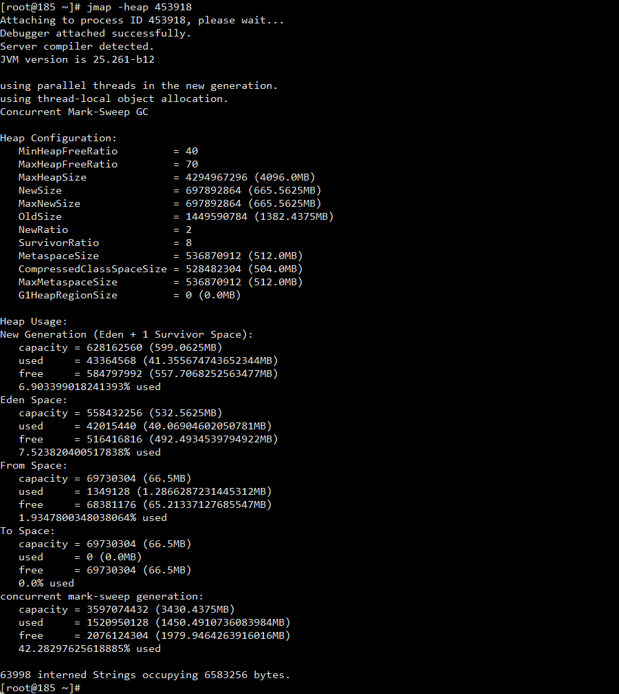
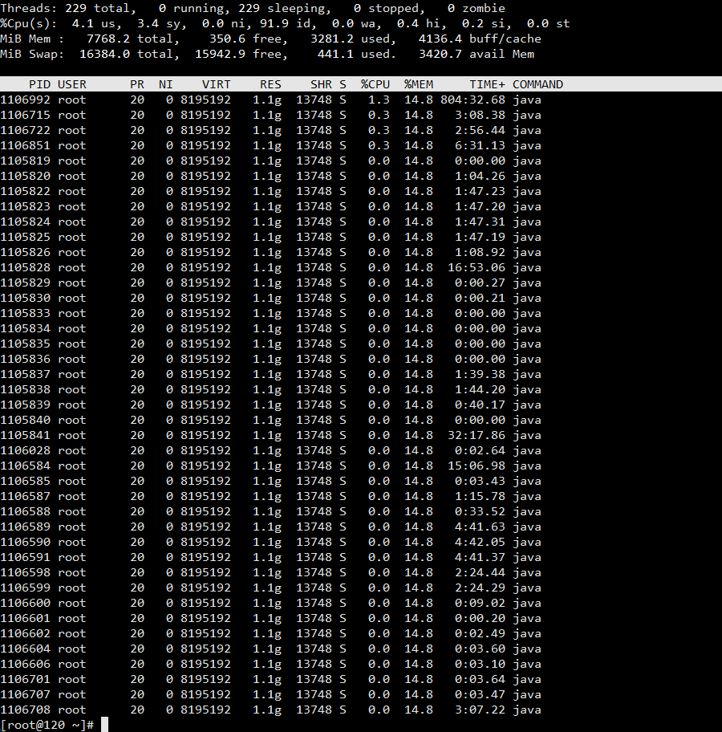

## jps
>jps命令用于查询正在运行的JVM进程

## jstat
>jstat -gcutil <pid> <刷新间隔时间-毫秒>

## jinfo
>jinfo用于查询当前运行这的JVM属性和参数的值

## jmap
>jmap -heap <pid>

# 一、Heap Configuration（堆的配置）

MinHeapFreeRatio
空闲堆空间的最小百分比，值的区间为0到100，默认值为 40。
计算公式为：HeapFreeRatio =(CurrentFreeHeapSize / CurrentTotalHeapSize) * 100。
如果当前HeapFreeRatio < MinHeapFreeRatio，则需要进行堆扩容，扩容的时机应该在每次垃圾回收之后。
MaxHeapFreeRatio
空闲堆空间的最大百分比，值的区间为0到100，默认值为 70。
计算公式为：HeapFreeRatio =(CurrentFreeHeapSize / CurrentTotalHeapSize) * 100。
如果HeapFreeRatio > MaxHeapFreeRatio，则需要进行堆缩容，缩容的时机应该在每次垃圾回收之后。
MaxHeapSize
堆空间允许的最大值。
NewSize
新生代堆空间的默认值。
MaxNewSize
新生代堆空间允许的最大值。
OldSize
老年代堆空间的默认值。
NewRatio
新生代（2个Survivor区和Eden区 ）与老年代（不包括永久区）的堆空间比值。
SurvivorRatio
两个Survivor区和Eden区的堆空间比值，默认是8，表示 S0 ： S1 ：Eden = 1：1：8。
MetaspaceSize
元空间的默认值
CompressedClassSpaceSize
压缩类空间大小
MaxMetaspaceSize
元空间允许的最大值
G1HeapRegionSize
在使用 G1 垃圾回收算法时，JVM会将Heap空间分隔为若干个Region，该参数用来指定每个 Region 空间的大小

## top 
>top -Hp <pid> 可以查看该进程下各个线程的cpu使用情况；

## jstack
>查看所有线程 jstack pid > 文件
>查看某线程池线程数量 jstack -l pid | grep "pool名称" -c