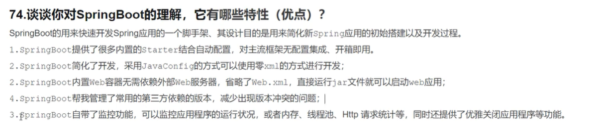
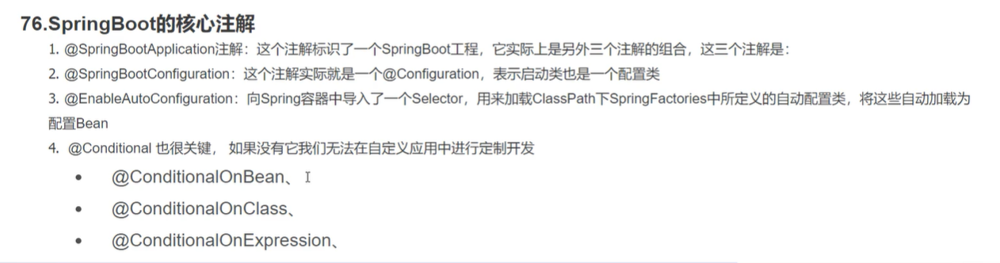
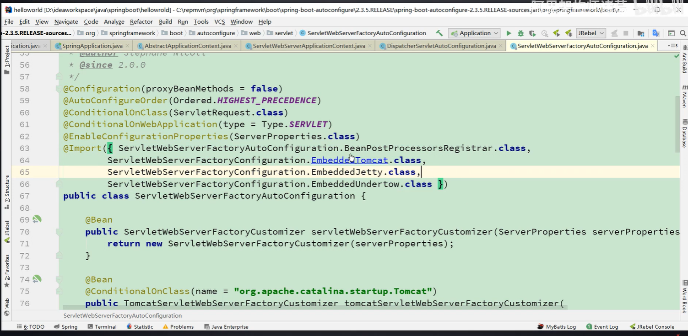
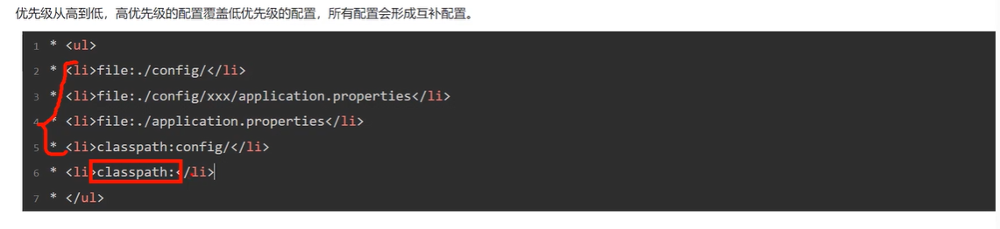
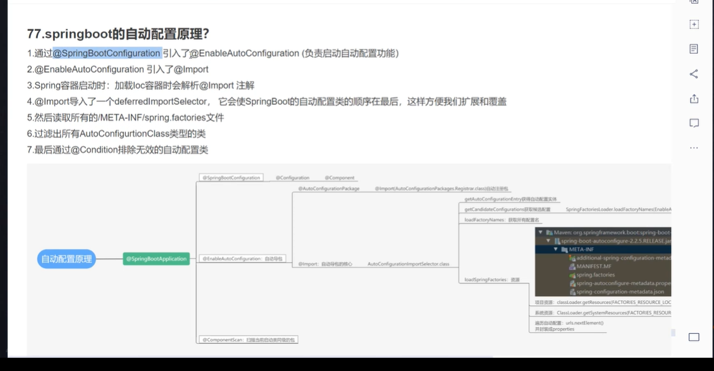
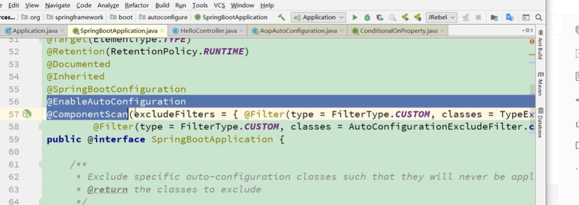

# springboot的理解

# springboot核心注解

# springboot内置tomcat启动原理
内嵌

1.在自动配置类中启动内嵌Tomcat，并配置一个Tomcat服务工程；
2.springboot启动的时候会创建spring容器，之后在spring容器加载的时候解析配置类去获得Tomcat服务的工厂，然后启动tomcat，之后挂起，就可以等待请求了。

# 自定义starter

# 读取配置文件原理
通过事件监听器的方式读取配置文件：ConfigFileApplicationListener
properties

# 自动配置原理

# 常用注解
