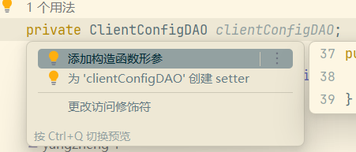
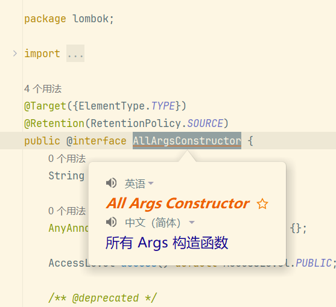

## @Autowired

1. @Autowired 注解可用于为类的属性、构造器、方法进行注值。

默认情况下，其依赖的对象必须存在（bean 可用），如果需要改变这种默认方式，可以设置其 required 属性为 false。

2. @Qualifier 注解可用于为@Autowired 注解提供额外的限定信息，以帮助 Spring IoC 容器选择正确的 bean 进行自动装配。

## 构造方法注入
```
public class UserTestServiceImpl {
 
    private UserTestDao userTestDao;
    /**
     * 如果只有一个有参数的构造方法并且参数类型与注入的bean的类型匹配，那就会注入到该构造方法中。
     *
     * @param userTestDao
     */
    public UserTestServiceImpl(UserTestDao userTestDao) {
        this.userTestDao = userTestDao;
    }
 
    public void login() {
        System.out.println("UserTestServiceImpl.login()");
        userTestDao.login();
    }
 
}
搭配lombak注解 @AllArgsConstructor 效果正好

```

## setter 注入

```
public class UserTestServiceImpl {

    private UserTestDao userTestDao;

    public UserTestDao getUserTestDao() {
        return userTestDao;
    }
    /**
    * setter注入，该setter方法不可缺少，否则会注入失败。
    */
    public void setUserTestDao(UserTestDao userTestDao) {
        this.userTestDao = userTestDao;
    }
    public void login() {
        System.out.println("UserTestServiceImpl.login()");
        userTestDao.login();
    }

}
```
