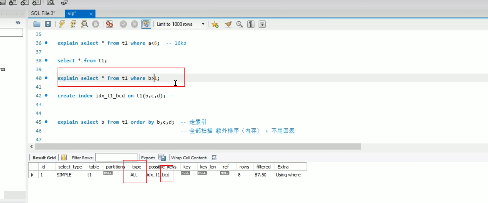

# 概述MyISAM和InnoDB
1. InnoDB：MySQL默认的事务型引擎，也是最重要和使用最广泛的存储引擎。

它被设计成为大量的短期事务，短期事务大部分情况下是正常提交的，很少被回滚。

InnoDB的性能与自动崩溃恢复的特性，使得它在非事务存储需求中也很流行。

除非有非常特别的原因需要使用其他的存储引擎，否则应该优先考虑InnoDB引擎

2. MyISAM：在MySQL 5.1 及之前的版本，MyISAM是默认引擎。
是 MySQL数据库服务器中的组件，负责为数据库执行实际的数据I/O操作。

MyISAM提供的大量的特性，包括全文索引、压缩、空间函数（GIS）等。

但MyISAM并不支持事务以及行级锁，而且一个毫无疑问的缺陷是崩溃后无法安全恢复。

正是由于MyISAM引擎的缘故，即使MySQL支持事务已经很长时间了，在很多人的概念中MySQL还是非事务型数据库。

尽管这样，它并不是一无是处的。对于只读的数据，或者表比较小，可以忍受修复操作，则依然可以使用MyISAM（但请不要默认使用MyISAM，而是应该默认使用InnoDB）。

# B+树
每创建一个索引生成一个B+树

>联合索引（a、b、c）排序先a再b再c，（148、213、391、392）

问题：字符串的索引创建的时候是怎么排序的?
>字符串编码

# 最左前缀原则

# 索引失效
>order by 排序的是索引字段，进行全表扫描很快，索引本身已经排序，不用回表。

>由于字符类型转化，对字段进行操作会导致索引失效
数据表中，mobile字段是varchar类型，但是SQL中的条件参数是数值类型，参数类型和字段类型不匹配，无法使用索引，走了全表扫描。
>SELECT * FROM student_info WHERE mobile = 17271119709;

如果数据表中，字段是数值类型，查询的时候使用数值字符串也可以正常使用索引。
>SELECT * FROM student_info WHERE school_id = '101';
>SELECT * FROM student_info WHERE id = '10001';

>不符合最左前缀原则索引失效

# 覆盖索引

# 字符转数字

# 聚簇索引

# 锁

共享锁-读锁
排它锁-写锁

代码实现
乐观锁：通过版本号、等条件实现
悲观锁：行锁、表锁

# mysql慢查询如何优化
1. 检查是否走了索引，如果没有则优化sql利用索引
2. 检查所用的索引是否为最佳索引
3. 检查查询字段是不是都是必须的，指定查询的字段不用selet *
4. 检查表中数据是不是过多，是否应该分库分表
5. 检查数据库所在服务器的资源配置

# 分库分表

# 事物基本特性
1. 原子性(Automic)：一个动作要么做完，要么不做。

2. 一致性(Consistency)：保证数据处于一致性的状态，我理解就是保证数据有意义的。

3. 隔离性(Isolation)：多个事务并行的结果，应该和多个事务串行的结果一致。

4. 持久性(Duration)：一个事务一旦成功提交，对数据改变是永久性的。

# 事物隔离级别
读已提交
都未提交
可重复读 会被insert影响 read view 配合间隙锁解决
串行