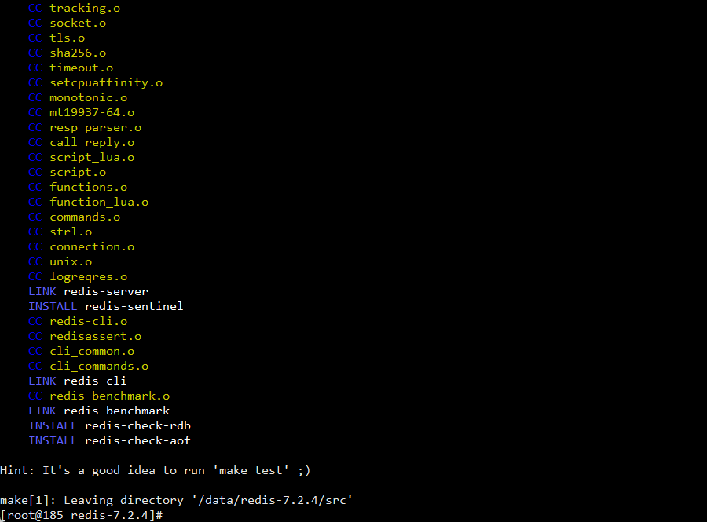
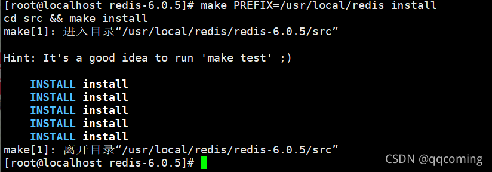
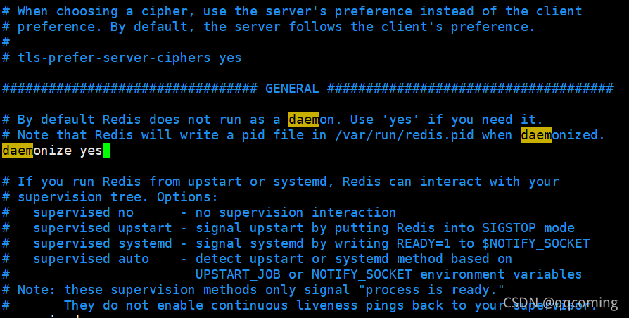

1. 选着自己需要下载的版本后，右击选择复制链接，然后利用命令进行下载，进入Xshell控制台，输入wget将复制的链接粘帖上

>wget https://download.redis.io/releases/redis-7.2.4.tar.gz

2. 解压
将下载的redis压缩包解压到指定的目录，一般是将redis目录放在usr/local/redis目录下，可以使用-C指定到解压下目录
>tar -zvxf redis-7.2.4.tar.gz -C /usr/redis

解压后当前的目录出现一个redis-6.0.5的目录，就是我们刚刚解压的目录

3. 编译
由于redis是c语言编写的，所以我们需要先安装gcc，安装的命令如下：
>yum install gcc-c++

如果无法下载gcc 需要安装离线包 
>进入到目录，忽略依赖强制安装所有rpm包
>rpm -ivh *.rpm --nodeps --force

>然后进入到redis目录，进入redis-6.0.5，然后执行make，控制台会输出一编译的信息

4. 安装

>make install PREFIX=/usr/local/redis
执行结果如下：

自此redis就安装成功了。
可以进入/src目录输入命令查看安装的redis版本
redis-lic -v

5. 启动
进入src目录下，输入命令启动redis
>cd src
>./redis-serve

可以修改redis.conf的配置来设置redis以守护进程的形式启动,将daemonize no改为yes

6. 查看Redis运行情况：
>输入命令：
ps -ef|grep redis

不设置密码服务器以外访问不到
进入客户端
>cd src
>./redis-cli
修改密码
>config set requirepass 123456
查看密码
>config get requirepass
