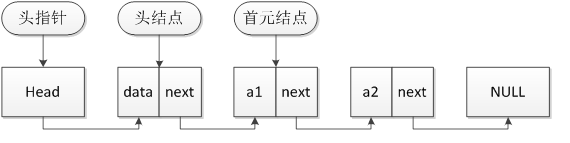

# C中的指针
```
指针是一个变量，他的值是可以变得，他里面存的是一个地址
假设我们定义一个指针 int *p; int a;
如果p = &a;
这个时候我们知道，a是一个变量，那么内存必定要给他分配一个地址来存储他，p指向a的意思就是p里面存的就是a的地址。所以p就是一个存着地址的变量。
既然我们知道p里面存着a的地址，那么我们要找a就非常方便了，*p就表示p存的地址里面的值，也就是a的值。
这句话怎么理解呢？
1.p存的是地址，比作你住的地方，那么*p就表示你了，因为*p就表示这个地址里面的数据。
这个时候*p和a是完全一样的了，假如你要改变a的值。a = a+1和*p =*p+1是完全一样的，都能达到对a进行操作的目的。但是*p =*p+1和*p = *(p+1)是不一样的，这个用的时候要特别注意，因为p里面是地址,那么*（p+1）就表示这个地址加1后，地址加1那不就是换了一个地址吗？换了一个地址后里面存的就肯定不是a了，就像可能是你的邻居了。因为地址变了，所以就是p变了，因此*也变了。
  总结一句话：指针是一个万能钥匙，可以指向任何一个地址，可以改变任何一个地址里面的数据（只读的除外），因此使用指针要注意安全，以免发生异常。
  ```
  # 链表中的指针
  
  ```
  链表内包含很多结点（当然也可以包含零个结点）。其中每个结点的数据空间一般会包含一个数据结构（用于存放各种类型的数据）以及一个指针，该指针一般称为next，用来指向下一个结点的位置。由于下一个结点也是链表类型，所以next的指针也要定义为链表类型。
  ```
  
  ```
public class Node {
     protected Node next; //指针域  
     public  int data;//数据域  
       
     public Node( int data) {  
           this. data = data;  
     }  
}
```
>数据结构Java版：链表
>https://blog.csdn.net/ustcluter/article/details/123232938

  