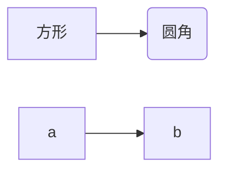

# HELLO WORLD

## 标题 2

- 列表 1
- 列表 2

[链接](http://www.b)


```
public class HelloWorld {
    public static void main(String[] args) {
        System.out.println("Hello, World!");
    }}
```

---

**asas**
_as_
~~as~~
列表:

- 无序列表
  - 嵌套无序列表
  - 嵌套无序列表
- 无序列表
- 无序列表

1. 有序列表
2. 有序列表
3. 有序列表

> 引用
> public class HelloWorld {

    public static void main(String[] args) {
        System.out.println("Hello, World!");
    }}

> [链接](http://www.b)
表格:

| 表头 | 表头 |
| ---- | ---- |
| 内容 | 内容 |
| 内容 | 内容 |

一级标题
=======

二级标题
-------

任务列表:

- [x] 已经完成的事 1
- [x] 已经完成的事 2
- [x] 已经完成的事 3
- [ ] 仍未完成的事 4
- [ ] 仍未完成的事 5

